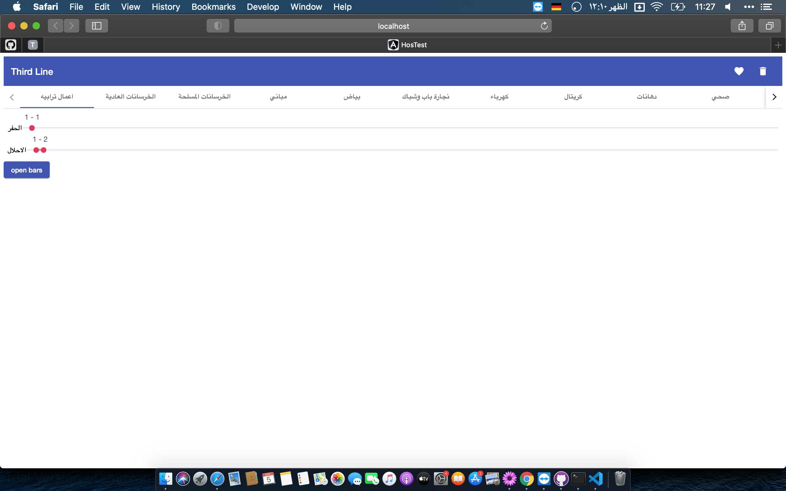
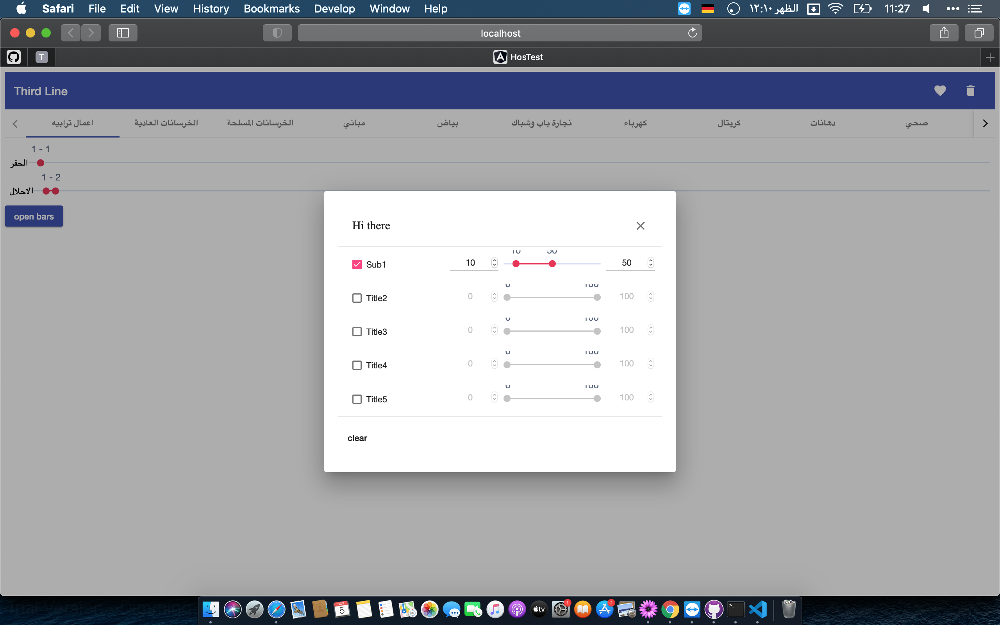

# hosCMS
Construction Management System

 The results of this app is published at https://mnourgwad.github.io/hosCMS/

## Build and Run
* To build and run the app (for development):
```terminal
ng serve --host 0.0.0.0 -o
```

* To deploy to github pages:

```terminal
ng build --prod --output-path docs --base-href hosCMS
```

## Output


