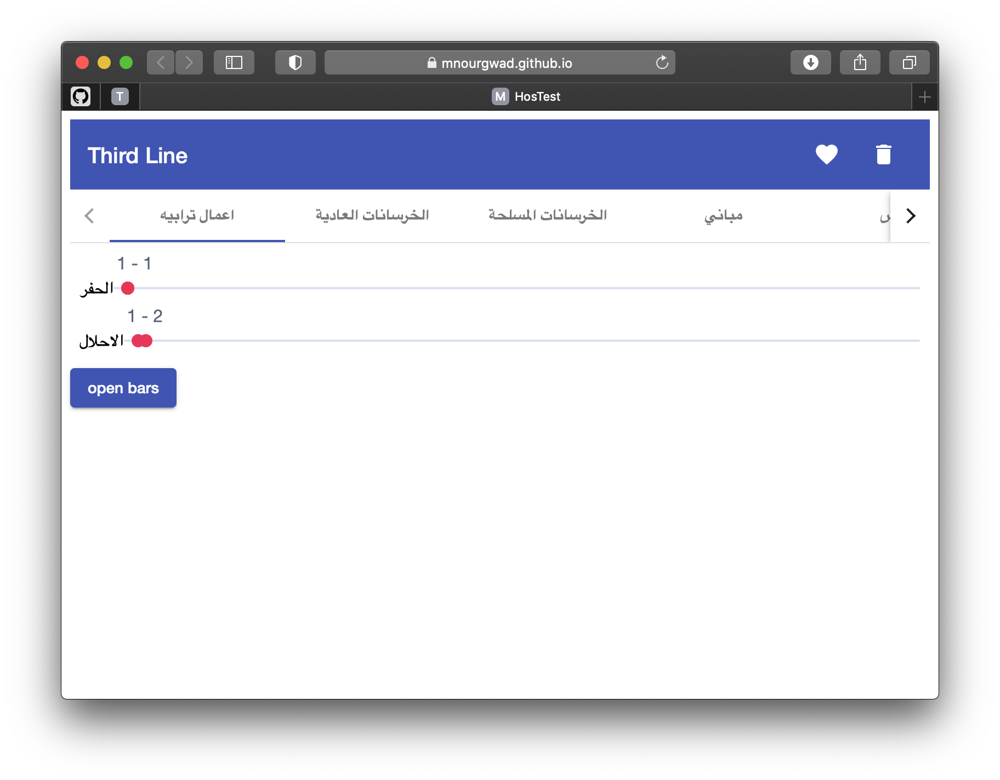
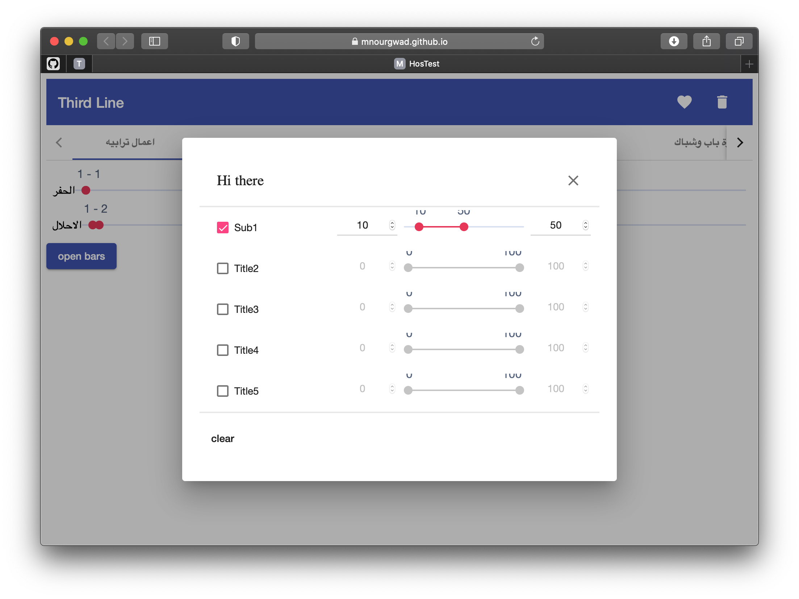

# hosCMS
Construction Management System

 The results of this app is published at https://mnourgwad.github.io/hosCMS/

## Build and Run


* **Clone the project**  
Change the current working directory to the location where you want the cloned directory to be:

```terminal
cd ~/workspace
```

* Clone the project by running the following command:

```terminal
git clone https://github.com/mnourgwad/hosCMS.git
cd hosCMS
```
* Serve the application  
To build and run the app (for development):

```terminal
npm install
ng serve --host 0.0.0.0 -o
```

* To deploy to github pages:

```terminal
ng build --prod --output-path docs --base-href hosCMS
```

## Output




## Resources
* uses ngx/ng5 slider component https://angular-slider.github.io/ngx-slider/home
